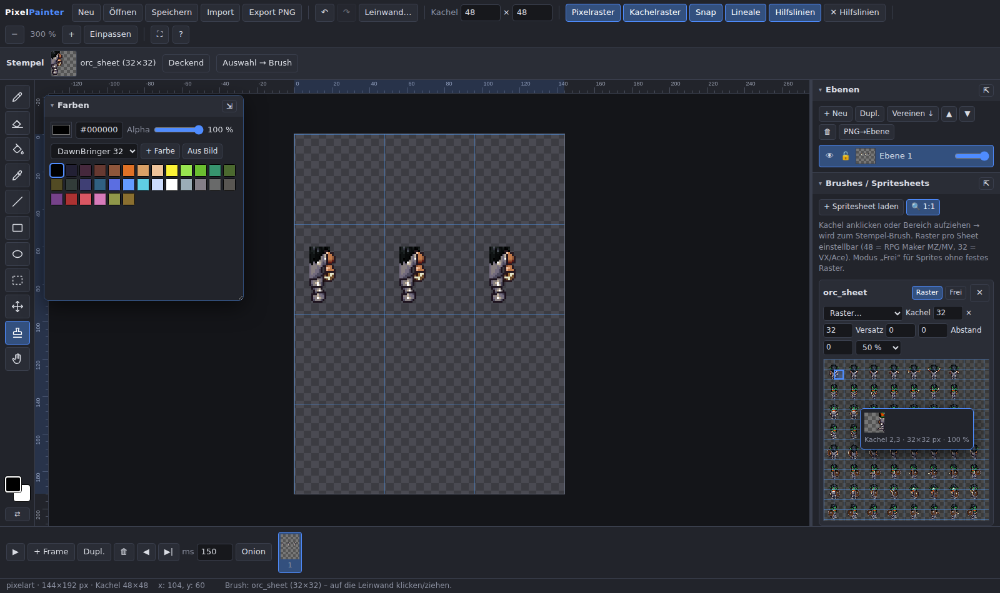

# Pixel Painter – Pixel-Art-Editor für Videospiel-Grafiken

Ein vollständiger Pixel-Art-Editor in **einer einzigen HTML-Datei**. Kein Build, kein Server,
kein Deploy: `index.html` im Browser öffnen (Doppelklick genügt) und loslegen.



## Start

```
index.html im Browser öffnen (Chrome, Edge, Firefox – alles lokal, file:// reicht)
```

## Funktionen

### Leinwand & Vorlagen
- Eigene Größen (bis 2048×2048) oder Vorlagen: Einzeltiles (16/32/48), **RPG Maker MZ/MV**
  (Charakter 144×192, Charakterblatt 576×384, Tilesets 768×768 / A2 768×576),
  RPG Maker VX/Ace, Game Boy, PICO-8, Icons
- Leinwandgröße nachträglich änderbar (9 Anker-Positionen oder Nearest-Neighbor-Skalierung)
- Kachelgröße pro Dokument einstellbar (Raster & Snap), z. B. 48 px für RPG Maker MZ/MV

### Sprite-Brushes – der Clou 🎯
- Fertige Spritesheets (z. B. RPG-Maker-Tilesets oder -Charaktere) als PNG **hochladen**
  (Button „Import“ / „+ Spritesheet laden“ oder einfach ins Fenster ziehen)
- Rastergröße pro Sheet einstellbar: 48 (MZ/MV), 32 (VX/Ace), frei – inkl. Versatz & Abstand;
  beim Laden wird das Raster automatisch erraten
- **Kachel anklicken oder mehrere Kacheln aufziehen → wird zum Stempel-Brush**:
  Terrain, Objekte oder ganze Sprite-Blöcke direkt auf die Leinwand malen
- Modus **„Frei“** für eigene Sprites ohne festes Raster: beliebigen Pixelbereich aufziehen
- Optional „Deckend“ stempeln (Transparenz überschreiben)
- Auswahl auf der Leinwand per „Auswahl → Brush“ selbst zum Stempel machen (auch Strg+C/Strg+V)

### Malwerkzeuge
- Stift, Radierer (Größe 1–64), Flood-Fill (auch global „alle gleichen Farben ersetzen“),
  Pipette (auch Alt+Klick), Linie, Rechteck, Ellipse (Umriss/gefüllt, Umschalt = 45°/Quadrat/Kreis)
- **Symmetrie**: Spiegel X / Spiegel Y beim Zeichnen
- Rechteck-Auswahl mit Verschieben, Kopieren/Ausschneiden/Einfügen, Entf;
  alle Malwerkzeuge werden an der Auswahl geklippt
- Rechtsklick malt mit der Hintergrundfarbe, X tauscht Vorder-/Hintergrundfarbe
- Farbpaletten: DawnBringer 32, PICO-8, eigene Paletten, „Palette aus Bild“, Alpha-Regler
- Unbegrenztes Undo/Redo (bis 80 Schritte)

### Ebenen
- Beliebig viele Ebenen: anlegen, duplizieren, verschieben, nach unten vereinen, löschen
- Sichtbarkeit, Sperren, Deckkraft pro Ebene, Umbenennen per Doppelklick
- PNG-Datei direkt als neue Ebene importieren

### Animation
- Frame-Timeline mit Thumbnails: anlegen, duplizieren, verschieben, löschen
- Anzeigedauer pro Frame (ms), Playback in der App (Enter)
- **Onion-Skin** (vorheriger Frame rötlich, nächster bläulich)
- Export als Animations-Spritesheet (Spaltenzahl wählbar)

### Raster, Lineale, Hilfslinien
- Pixelraster (ab 800 % Zoom) und Kachelraster
- **Snap to Grid**: Stempel, Auswahl, Verschieben und Hilfslinien rasten an der Kachelgröße ein
- Lineale in Pixeln mit Cursor-Markierung
- **Hilfslinien** aus den Linealen ziehen, mit Umschalt+Ziehen verschieben,
  zum Löschen zurück aufs Lineal ziehen
- Zoom 12,5 %–6400 % (Mausrad), Verschieben mit Leertaste/mittlerer Maustaste

### Oberfläche & Panels
- Panels (Farben, Ebenen, Brushes) per Klick auf den Titel **ein-/ausklappbar**
- Panels per Drag am Titel **neu anordnen** – oder nach links aus der Sidebar ziehen
  bzw. ⇱ klicken, um sie als **frei bewegliche, größenveränderbare Fenster abzudocken**
  (⇲ dockt wieder an)
- **Sidebar-Breite** am linken Rand per Drag einstellbar
- **🔍 1:1-Lupe**: Kacheln im Brush-Panel beim Überfahren in Originalgröße ansehen
  (praktisch bei verkleinerter Sheet-Vorschau)
- **Vollbildmodus** über ⛶ oder Taste `F`
- Das komplette Layout (Reihenfolge, Breite, abgedockte Fenster, Lupe) wird
  automatisch gemerkt (localStorage)

## Speichern & Export

| Format | Inhalt |
|---|---|
| **`.pixelpainter.json`** (Speichern/Öffnen) | Projektformat **mit allen Ebenen**, Frames, Palette, Hilfslinien und geladenen Brush-Spritesheets |
| **PNG** (Export) | Aktueller Frame, nur aktive Ebene oder alle Frames als Spritesheet – Skalierung 1×–16× |

## Tastaturkürzel

`B` Stift · `E` Radierer · `G` Füllen · `I` Pipette · `L` Linie · `U` Rechteck · `O` Ellipse ·
`M` Auswahl · `V` Verschieben · `S` Stempel · `H` Hand · `X` Farben tauschen ·
`[` `]` Stiftgröße · `+`/`−`/`0` Zoom/Einpassen · `Strg+Z/Y` Undo/Redo ·
`Strg+A/D` Alles/Nichts auswählen · `Strg+C/X/V` Kopieren/Ausschneiden/Einfügen ·
`Entf` Auswahl löschen · `Enter` Animation · `F` Vollbild · `Esc` Abbrechen · `?` Hilfe

Die vollständige Hilfe ist in der App über den `?`-Button erreichbar.

## Tests

End-to-End-Tests (Playwright, Chromium erforderlich):

```
NODE_PATH=$(npm root -g) node tests/e2e.js
```

Die Suite deckt Zeichnen, Füllen, Formen, Undo/Redo, Ebenen, Frames/Playback,
Sprite-Brush-Workflow, Snap, Hilfslinien, Auswahl/Verschieben, Projekt-Speichern/-Laden,
PNG-Export sowie das Panel-Layout (Einklappen, Anordnen, Abdocken, Sidebar-Breite,
1:1-Lupe, Vollbild, Layout-Persistenz) ab (43 Checks).
